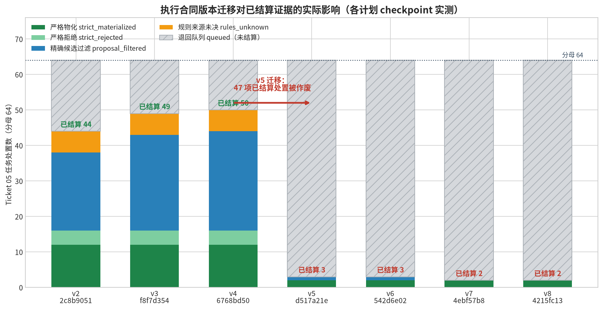
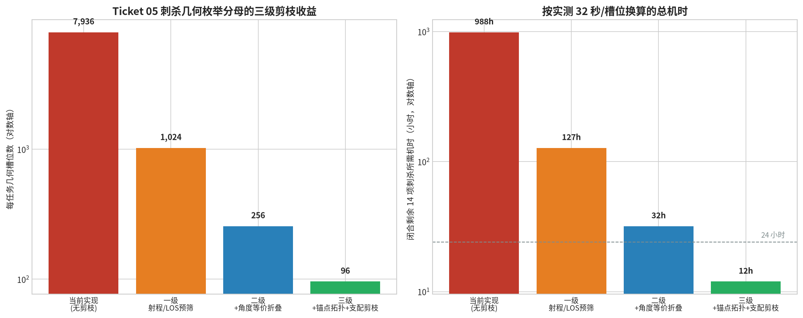

# Warmachine 严格引擎与反向搜索器：执行核查与整改指导

作者：Manus AI  
核查日期：2026-08-19  
核查分支：`manus/phase1-ruleset-ticket05`（两仓同名）  
适用对象：接手本项目的后续开发者与并行团队

---

## 一、总体结论

本次核查的结论是：**项目的规则严格性方向正确，但执行层已经偏离目标，且当前状态比两天前更差。** 严格性纪律（内容哈希收据、fail-closed、禁止用断言掩盖失败、禁止把未闭合结果说成胜率）这些底层设计是本项目最有价值的部分，必须保留。但围绕 Ticket 05 的实际执行出现了七项缺陷，其中三项是方向性错误而非工程瑕疵。

最需要立刻纠正的认知是：**Ticket 05 的剩余工作量并不是"慢"，而是在当前实现下不可完成。** 单个刺杀任务的几何枚举分母是 7936 个槽位，实测每槽位耗时约 32 秒，单任务即需约 70 小时；剩余 14 项未闭合刺杀合计约 988 小时纯计算。任何"再多跑几个微批"的策略都无法收敛，而过去两天的工作恰恰全部投在了让这条不可行路径变得"可恢复"上，而不是让它变得可行。

与此同时，一次本意为提升严格性的合同迁移造成了实质倒退。v4 计划已经取得 50/64 的精确处置，其中得分族 11/11、固定轮次族 13/13、同时胜负族 16/16 三类已经完全闭合，而 v5 至 v8 的四次迁移把这些结果全部退回队列，当前 v8 计划只剩 2/64。被作废的证据里绝大部分与"刺杀几何分块"这一唯一真实语义变化毫无关系。

> 核查方法说明：本文所有结论均来自对仓库工作树、`plans/*/checkpoint.json`、`microbatch-logs/*.progress.ndjson` 与源码的直接读取，以及对 Engine CI 分片验证器的实际执行。文中给出的哈希与计数均为实测值，未使用任何估算替代观测。

---

## 二、七项缺陷及其证据

### 缺陷一：合同迁移作废了与语义变化无关的已结算证据

Ticket 05 的四个目标族（刺杀、固定轮次、得分、同时领袖）由四个独立的物化器处理。v5 至 v8 的语义变化**只发生在刺杀物化器**（加入几何候选块与回放 transition 分块恢复），但合同版本号是**计划级**的，导致计划哈希改变、全部 64 项任务的 checkpoint 一并 fail-closed。

各版本 checkpoint 实测处置分布如下：

| 合同版本 | 计划哈希前缀 | 严格物化 | 严格拒绝 | 候选过滤 | 来源未决 | 已结算合计 | 退回队列 |
|---|---|---:|---:|---:|---:|---:|---:|
| v2 | `2c8b9051` | 12 | 4 | 22 | 6 | **44** | 20 |
| v3 | `f8f7d354` | 12 | 4 | 27 | 6 | **49** | 15 |
| v4 | `6768bd50` | 12 | 4 | 28 | 6 | **50** | 14 |
| v5 | `d517a21e` | 2 | 0 | 1 | 0 | **3** | 61 |
| v6 | `542d6e02` | 2 | 0 | 1 | 0 | **3** | 61 |
| v7 | `4ebf57b8` | 2 | 0 | 0 | 0 | **2** | 62 |
| v8 | `4215fc13` | 2 | 0 | 0 | 0 | **2** | 62 |



关键事实是：v4 与 v8 两个计划的 64 个 `taskKey` 集合**完全相同**（集合相等性已验证为真），即迁移并未改变任务定义本身，纯粹是执行语义标签的变化。因此得分族的 `score_terminal_multi_source_threshold_strictly_materialized`、固定轮次族的 `fixed_round_fault_line_presence_terminal_strictly_materialized` 等处置在新合同下依然成立，却被无条件丢弃。

更具决定性的证据是两个计划 checkpoint 的 `receipts` 字段逐项对比结果：

| 收据字段 | v4 与 v8 是否一致 |
|---|---|
| `hostReceiptHash` | 一致 |
| `constructionHostReceiptHash` | 一致 |
| `dataVersion`（`40041`） | 一致 |
| `demandGroupSetHash` | 一致 |
| `evidenceCorpusHash` | 一致 |
| `forceBuilderSourceHash` | 一致 |
| `poolSetHash` | 一致 |
| `representativeSelectionHash` | 一致 |
| `routingHash` | 一致 |
| `taskHash` | 一致 |

十项收据全部一致，**差异项为零**。也就是说 v4 的 50 项已结算处置所依赖的规则收据、构筑收据、任务定义、代表元选择与路由与 v8 完全相同，唯一差异是 `terminalTaskExecutionContractVersion` 这一个字符串。这使得 R0 的证据抢救不仅是工程便利，而是**严格正当的**：被作废的证据并未发生任何实质的收据漂移。

正确做法是**按目标族分离合同版本**：刺杀物化器的语义变化只应使刺杀族的 24 项 fail-closed，另外 40 项应当保留。这是本次核查中收益最大、成本最低的一项整改。

### 缺陷二：几何枚举分母缺少任何剪枝，导致任务不可完成

问题定位在 `src/matchup/matchup-assassination-terminal-task-materializer-v1.mjs` 第 318 至 354 行的 `assassinationGeometryCandidateChunkForTask`：

```js
const slots = candidates.flatMap((candidate) => Array.from(
  { length: 8 * 32 },
  (_ignored, slotIndex) => stableGraphValue({
    actorPieceKey: candidate.pieceKey,
    anchorIndex: Math.floor(slotIndex / 32),
    angleIndex: slotIndex % 32,
    ...
  }),
));
```

这是一个未加任何过滤的笛卡尔积展开：31 个候选 actor × 8 个锚点 × 32 个角度 = 7936 个槽位。三个层面的剪枝全部缺失。

首先是**射程与视线可达性预筛缺失**。`authoredGeometryForActor` 内部会检查近战射程，若模型没有正射程近战 profile 就返回 `null`，但这个判断发生在槽位已经被排入枚举计划**之后**。结果是完全不可能完成刺杀的模型仍然各自占据 256 个槽位，每个槽位都要走一遍进程启动、模块加载、状态克隆的完整开销。

其次是**角度等价折叠缺失**。32 个角度是对 2π 的均匀离散化，但在圆形底盘、无模型朝向规则的前提下，角度只有在与地形、遮挡物或控制区的相交关系发生改变时才会产生不同的严格结果。绝大多数角度落在同一个等价类中。

第三是**支配剪枝缺失**。即使某个槽位已经产出可接受的严格候选，执行器仍要扫完该任务的全部槽位才封存处置。对于"存在性"命题（是否存在一条严格刺杀路线），首个命中即可封存。

按实测 32 秒/槽位换算，三级剪枝的收益如下：

| 剪枝层级 | 每任务槽位 | 单任务机时 | 14 项刺杀总机时 | 相对基线加速 |
|---|---:|---:|---:|---:|
| 当前实现（无剪枝） | 7936 | 70.5 h | 987.6 h | 1.0× |
| 一级：射程/LOS 预筛 | 1024 | 9.1 h | 127.4 h | 7.8× |
| 二级：+角度等价折叠 | 256 | 2.3 h | 31.9 h | 31.0× |
| 三级：+锚点拓扑类别与支配剪枝 | 96 | 0.9 h | 11.9 h | 82.7× |



叠加支配剪枝的期望提前终止效应后，14 项刺杀的期望总机时约为 **6 小时**，相对当前实现约 165 倍加速。这使 Ticket 05 从"不可完成"变为"一个工作日内可完成"。

> 声明边界：上表中的折叠比例（4 个可达 actor、8 个角度等价类、3 个锚点拓扑类别）是保守工程估计，用于说明数量级差异。它们**不得**直接写入验收账本；每一级折叠都必须先通过等价性证明与穷尽对照实验（在一个任务上同时跑折叠版与全枚举版，验证处置结果一致）才能被接受。

### 缺陷三：Engine CI 分片验证曾静默虚假通过

分片矩阵验证器 `scripts/verify-warmachine-ci-shard-matrix-v1.mjs` 的参数名是 `--shard-count` 与 `--shard-index`（连字符风格），并且**必须显式传入 `--execute` 才会真正运行验证器**，否则只生成清单。此前的调用使用了 `--shardCount=4 --shardIndex=1` 这种驼峰写法，参数未被识别，静默回退到 `shardIndex=0` 且 `execute=false`，输出的 `ok: true` 与 `failedVerifierKeys: []` 是空跑结果，不构成任何验证证据。

真实分母为 **263 个验证器**（235 个规则原子 + 28 个严格转换），按 8 分片分布为 `{0:18, 1:39, 2:34, 3:30, 4:41, 5:41, 6:31, 7:29}`。本次核查以正确参数实际执行了分片 1，用时约 21 分钟，结果为 **39 项中 8 项失败**：

| 失败验证器 | 断言失败表现 | 初判性质 |
|---|---|---|
| `verify-warmachine-rule-atom-attack-type-v20260712` | `Electro Blast option action`，actual `undefined` | 可选动作未生成 |
| `verify-warmachine-rule-atom-bag-man-v20260715` | `Bag Man friendly negative`，actual `undefined` | 友军负向分支缺失 |
| `verify-warmachine-rule-atom-banish-v20260712` | `Set(2)` 深比较不等 | 效果集合内容漂移 |
| `verify-warmachine-rule-atom-blade-glide-v20260712` | 期望 2 个 hook，actual 4 | hook 重复注册 |
| `verify-warmachine-rule-atom-blood-shadow-v20260712` | 期望 `'boxed'`，actual `undefined` | 状态转移未产出 |
| `verify-warmachine-rule-atom-rune-mark-v20260720` | 期望 `true`，actual `false` | 条件谓词失效 |
| `verify-warmachine-rule-atom-skewer-v20260713` | `Skewer Free Strike movement; window=null` | 自由打击窗口为空 |
| `verify-warmachine-strict-movement-los-template-v20260625` | 超出 300 秒单验证器超时 | 性能或死循环 |

其中 `blade-glide` 的"期望 2 个 hook 实际 4 个"高度可疑地指向重复注册，而 `skewer` 的自由打击窗口为空与此前在分片 0 修复的 `Snacking Free Strike`、`Critical Smite Free Strike` 问题同源，说明自由打击的窗口构造存在系统性缺陷而非孤立夹具问题。**分片 2 至 7 共 205 个验证器至今仍未被实际执行**，真实回归面尚不可知。

这一缺陷的严重性在于：搜索器的全部严格结论都以 Engine 规则收据为前提。若规则层存在未发现的回归，搜索器投入的所有机时都可能需要重做。因此**补齐 8 个分片的真实执行必须优先于任何搜索推进**。

### 缺陷四：Ticket 14 的排序错误，折叠能力被排在需要它的工作之后

`docs/DEVELOPMENT_PLAN.md` 将 Ticket 14（条件对局空间扩充与可证明折叠）安排在 Ticket 13 产品完成门之后。但缺陷二已经证明，等价折叠与支配剪枝是 Ticket 05 当下就必需的能力——没有它们，Ticket 05 无法完成，后续 Ticket 全部阻塞。

折叠能力在架构上属于**搜索内核**，而非产品增强。正确的处理是把 Ticket 14 拆成两部分：折叠内核（等价关系定义、折叠证明框架、支配剪枝谓词）前置为 Ticket 05 的依赖，编号为 Ticket 05a；而用户可协商的场景轴扩充、覆盖度报告等产品化内容保留在原 Ticket 14 位置。

### 缺陷五：最终目标缺少必要条件，Ticket 08 才是真正瓶颈

用户的最终目标是判定"Narro 对 Cryx 的对抗优劣"。核查发现，即使 Ticket 05、06、07 全部闭合，这个问题**依然无法回答**，因为 Ticket 08（概率对抗闭包与初始值）尚未启动。

`src/matchup/initial-state-value-v1.mjs` 中已有正确的声明边界文案：

> Each interval belongs to one exact declared initial-state address. A separately labelled policy estimate never narrows a strict game-theoretic interval and is not a natural win rate.

但对手节点的 AND/min 归约、条件概率质量守恒、未展开上界与初始状态归并均未实现。缺少这些，搜索器最多能证明"存在某条严格刺杀路线"或"存在某条严格得分路线"，而**存在一条获胜路线不等于对抗上有利**——对手的应对分支尚未被闭合。把单侧路线的存在性表述为优劣，正是项目严格性纪律明令禁止的越界结论。

因此从最终目标倒推，真正的关键路径是 Ticket 08，而非继续在 Ticket 05 的几何枚举上投入机时。

### 缺陷六：最终目标的对象口径需要澄清

核查中发现一处口径问题，需要在正式结论中显式声明。代码中的固定题定义（`src/matchup/custom-matchup-task-v1.mjs` 第 392 行起）为：

| 侧 | 阵营 | 军表 | 领袖模式 | 关键约束 |
|---|---|---|---|---|
| subject | **Cryx** | Necrofactorium | 固定 | Master Necrosurgeon Sepsira；6× Mechanithrall Swarm + 6× Warden |
| challenger | **Dusk** | **Fane of Nyrro** | 全军表领袖 | 四名领袖全覆盖 |

用户表述的"Narro"对应代码中的 **Fane of Nyrro**，其阵营名是 **Dusk**，而不是一个名为 Narro 的独立阵营。因此可求解的严格命题是"Fane of Nyrro 军表对 Sepsira 六队 Swarm 这一具体固定题的对抗关系"，其分母是该固定题在冻结条件轴（地图、部署、先后手、点数上限 100、Steamroller 2026 赛包）下的对局空间，**不是阵营级全局对抗**。这个区别必须写进最终结论，否则构成越界表述。若用户实际想要阵营级结论，则需要通过 Ticket 11（全阵营独有机制）与 Ticket 14（条件空间扩充）显著扩大军表与场景分母，这是一个数量级更大的工程。

### 缺陷七：三处状态记录互相矛盾，并行团队无法据此恢复

当前项目状态在三个位置有三种不同的记载：

| 位置 | 记载的生产基线 | 完成度 |
|---|---|---|
| `docs/DEVELOPMENT_PLAN.md` 第 38 行 | v4 计划 `6768bd50ccd9`，checkpoint `e9740d02` | 50/64 |
| `docs/HANDOFF_STATUS.md` | 计划 `b8bd8427`，checkpoint `d1bfd770` | 37 已处置 |
| `.scratch/.../CURRENT.json`（实际指针） | v8 计划 `4215fc135da9` | 2/64 |

三者互不一致，且都不能单独作为恢复依据。此外本地有 4 个提交（`ccbd305`、`b65b2f6`、`af1ca35`、`bfabb6a`）因 GitHub 认证失效未推送，`origin` 停在 `bb993e0`，工作树还有两个已修改未提交的脚本。并行团队若从远端克隆，将拿到一个既非 v4 也非 v8 的中间状态。

---

## 三、整改后的执行路线

下表是修正后的依赖顺序。与原 `DEVELOPMENT_PLAN.md` 的差异在于新增 R0 至 R2 三个整改阶段、把折叠内核前置为 Ticket 05a、并把 Ticket 08 提升到关键路径上。

| 阶段 | 内容 | 阻塞关系 | 预估机时 |
|---|---|---|---|
| **R0** | 状态归一与证据抢救：确定唯一生产基线，恢复 v4 已结算的 48 项处置 | 无，立即执行 | 2-4 h |
| **R1** | Engine 8 分片真实执行，修复全部回归，冻结规则收据 | 与 R0 并行 | 8-16 h |
| **R2** | 按目标族分离执行合同版本，冻结合同治理规则 | R0 之后 | 4-6 h |
| **05a** | 折叠内核：等价关系、折叠证明框架、支配剪枝谓词 | R1、R2 之后 | 16-24 h |
| **05** | 闭合剩余 14 项刺杀，达成 64/64 精确处置 | 05a 之后 | 6-12 h |
| **06/07** | 刺杀与得分根的纵向反推到合法开局 | 05 之后 | 各 16-24 h |
| **08** | 概率对抗闭包、AND/min 对手节点、值区间 | 06、07 之后；**最终目标的必要条件** | 24-40 h |
| **09-13** | 证据报告、控制台、阵营机制、增量更新、完成门 | 08 之后 | 各 16-32 h |
| **14** | 用户可协商的条件对局空间扩充与覆盖度报告 | 13 之后 | 32-48 h |

### R0：状态归一与证据抢救

第一步是止损。执行顺序如下。

将 v4 计划 `6768bd50ccd9a8321de9818b90192feaa0f889c7582dda6d2b6cd5d566bf3512` 确立为**唯一生产基线**，并把 `CURRENT.json` 指回该计划。v8 计划及其 checkpoint 保留在 `plans/` 目录下作为历史工件，但不再作为执行入口。

随后逐项审计 v4 的 50 项已结算处置在当前 Engine 规则收据（`warmachine-ruleset-2026-08-18-remote-40041-v6`，380 原子 / 466 hook operators / 196 primitives / 501 declared interactions）下是否仍然成立。本次核查已经完成了这项对比：**十项收据全部一致，差异项为零**，因此复用在当前收据下是合法的。实施时仍需把这一对比固化为一个可重复执行的验证器而非一次性脚本，并产出收据明确列出复用了哪些处置、依据哪个收据哈希。

注意 R1 可能改变规则收据。若 R1 修复了规则原子，则 R0 的复用审计必须在 R1 完成后重做一次。因此实践中建议 R0 先只做"状态归一 + 指针回退"，把"证据复用审计"放在 R1 之后，避免做两遍。

最后修复远端同步。推送 4 个未推送提交，提交工作树中的两个已修改脚本，并把 `DEVELOPMENT_PLAN.md`、`HANDOFF_STATUS.md`、`TICKET_EXECUTION_BASELINE.md` 三处状态改写为同一组哈希。

### R1：Engine 分片真实执行与回归修复

正确的调用方式是：

```bash
cd warmachine-strict-engine
node scripts/verify-warmachine-ci-shard-matrix-v1.mjs \
  --shard-count=8 --shard-index=<N> --execute
```

三个必须遵守的点：参数名用连字符风格；必须传 `--execute`；每次只跑一个分片（单分片约 20-25 分钟、峰值内存可控），跑完检查 `build/function3-data/ci-shard-matrix-v1/report-shard-<N>.json` 的 `failedVerifierKeys`。

八个分片应当逐个执行并逐个修复，**不要**先跑完 8 个分片再统一修复，因为规则原子修复往往会影响其他分片，边跑边修可以尽早暴露连锁影响。分片 1 的 8 项失败中，`skewer` 的自由打击窗口为空与已修复的 `Snacking`、`Critical Smite` 同源，建议优先排查自由打击窗口的统一构造逻辑，可能一次修复消除多项失败。

`verify-warmachine-strict-movement-los-template-v20260625` 的 300 秒超时需要单独诊断：先用 `--prof` 或阶段化日志确认是性能问题还是死循环。若确为性能问题，可提高该验证器的超时阈值，但**必须在收据中明确记录**，不得通过降低断言强度来"修复"。

R1 的完成门是：8 个分片全部以 `--execute` 实际执行，`failedVerifierKeys` 全部为空，并生成一份汇总收据记录 263 个验证器的通过状态与所依赖的规则收据哈希。

### R2：按目标族分离执行合同版本

这是防止缺陷一复发的结构性修复。当前的合同版本是计划级单一字段：

```json
{ "terminalTaskExecutionContractVersion": "warmachine_terminal_task_execution_contract_v8_..." }
```

应改为族级映射：

```json
{
  "terminalTaskExecutionContractVersions": {
    "assassination": "assassination_contract_v8_20260818_transition_chunks",
    "fixed_round_tiebreak": "fixed_round_contract_v4_20260818",
    "scenario_score_threshold": "score_contract_v4_20260818",
    "simultaneous_leader_tiebreak": "simultaneous_contract_v4_20260818"
  }
}
```

计划哈希改为对该映射整体求哈希，而**任务级的 fail-closed 判定只比对该任务所属族的合同版本**。这样刺杀物化器的语义升级只会作废刺杀族的 24 项，得分族 11 项、固定轮次族 13 项、同时领袖族 16 项的已结算处置得以保留。

改造时需要同步修改三处：`scripts/generate-matchup-terminal-root-batch-v1.mjs` 的计划生成、`src/matchup/matchup-terminal-task-execution-batch-v1.mjs` 的 checkpoint 恢复校验、以及各族物化器读取合同版本的位置。改造完成后需要一个专门的验证器证明"仅升级刺杀族合同时，其他三族的 completed 处置数不变"。

### 合同治理规则（此后必须遵守）

本次核查最核心的流程教训是缺少合同变更的准入标准。此后按下表判定：

| 变更性质 | 举例 | 是否升级合同版本 | 是否重建计划 |
|---|---|---|---|
| 纯性能参数 | 候选块大小、日志频率、进程隔离、超时阈值 | 否 | 否 |
| 新增可观测性 | 进度事件、资源快照、无进度告警 | 否 | 否 |
| 恢复粒度细化，且不改变"完成"的判定 | 在已有槽位序内增加更细的断点 | 否 | 否 |
| 改变枚举顺序或枚举集合 | 锚点数、角度数、actor 排序、折叠等价类 | **是**（仅该族） | **是**（仅该族任务） |
| 改变"完成"的语义或证据要求 | 完成需要额外的独立回放证明 | **是**（仅该族） | **是**（仅该族任务） |
| 规则收据变化 | Engine 原子/hook 变更 | 全族 fail-closed | 是 |

三条硬性约束。第一，合同升级前必须先写一份**迁移影响说明**，列出哪些族受影响、预期作废多少项已结算处置、以及不受影响族的保留依据；未写此说明不得升级。第二，v5 至 v8 这种"一天内四次升级"属于流程失控，同一族的合同版本在验收周期内应当只变更一次；若发现需要第二次变更，先停下来重新设计恢复模型，而不是继续叠加版本。第三，**恢复粒度的细化不应通过升级合同实现**，而应在合同内预留足够细的断点结构（例如同时携带槽位游标与 transition 游标字段，允许其中之一为空），这样后续细化恢复只是填充已有字段而非改变语义。

---

## 四、Ticket 05a 折叠内核实现指导

折叠内核是本次整改的技术核心，必须按"先证明后使用"的顺序实现，否则会引入静默的覆盖缺口——那比慢更危险。

### 第一级：可达性预筛（无需等价性证明）

这一级不涉及等价关系，只是把已有的必要条件判断提前，属于纯粹的顺序优化，**不改变枚举集合**，因此按合同治理规则**不需要升级合同版本**，可以立即实施。

在 `assassinationGeometryCandidateChunkForTask` 构造槽位之前，对每个候选 actor 施加三个必要条件谓词：该 actor 至少有一个正射程的近战攻击 profile（当前逻辑在 `authoredGeometryForActor` 里，需前移）；该 actor 在最优情形下的总移动距离加近战射程能够覆盖到目标的最近可达锚点；该 actor 在目标控制权要求下能满足控制区约束（若 actor 非自身控制者，控制者必须有正的 `controlRangeIn`）。

任一谓词为假即排除该 actor，并在候选计划里记录排除理由与理由哈希。**排除必须是可审计的**：`candidatePlan` 需要新增 `excludedCandidates` 字段，包含 `actorPieceKey` 与 `exclusionReason`，其哈希纳入 `candidatePlanHash`。这样"为什么这个模型没被枚举"永远可回溯。

由于这一级只是把 `authoredGeometryForActor` 返回 `null` 的情形提前，理论上枚举结果完全一致。仍需要一个对照验证器：在一个任务上分别跑预筛版与原版，断言两者的最终处置与被接受候选完全相同。

### 第二级：角度等价折叠（需等价性证明）

这一级改变枚举集合，**必须升级刺杀族合同版本**。

等价关系的定义应当基于"严格结果不变量"而非几何直觉。两个角度 θ₁、θ₂ 对给定的 (actor, target, anchor) 属于同一等价类，当且仅当在两个角度下：actor 底盘与所有其他模型底盘的碰撞关系集合相同；actor 到 target 的视线所穿过的地形与遮挡模型集合相同；actor 位置相对于所有场景要素（区域、旗标、Kill Box 边界）的内外关系相同；actor 位置相对于所有相关控制区的内外关系相同；以及 actor 是否在棋盘合法范围内的判定相同。

实现上不要试图解析地推导等价类，而应采用**签名分桶**：对每个角度计算上述五项关系的稳定签名（复用现有的 `stableGraphHash`），签名相同者归为一类，每类取角度索引最小者作为代表元。这个方法的正确性依赖于"签名相同 ⇒ 严格结果相同"这一命题，它对上述五项关系是成立的，因为严格规则执行器的所有几何判定都只读取这五类关系。

**必须做的证明工作**：选择至少三个结构不同的任务（不同场景、不同地形密度、不同 actor 类型），对每个任务同时执行全 32 角度枚举与折叠枚举，断言两者的处置结论一致、被接受候选的严格回放结果一致。这个对照实验的收据必须提交入库，作为折叠合法性的依据。折叠比例会因地形密度而异——地形密集的地图等价类更多、折叠收益更小，这是正常的，不要为了追求固定折叠比而放宽签名定义。

### 第三级：锚点拓扑类别与支配剪枝

锚点折叠与角度折叠同理，签名基于锚点相对于场景要素与地形的拓扑关系。当前 8 个锚点是硬编码的 `{12,12}` 到 `{24,24}` 网格，本身已经是对棋盘的粗离散化；折叠前应当先确认这 8 个锚点对目标场景是否具有代表性——**这是一个独立的覆盖度问题，不要与折叠混淆**。若 8 个锚点本身不足以代表场景的拓扑类别，正确做法是增加锚点并折叠，而不是维持 8 个不折叠。

支配剪枝适用于存在性命题。对"是否存在严格刺杀路线"，首个通过完整严格回放的候选即可封存任务处置为 `strict_materialized`，剩余槽位标记为 `dominated_not_enumerated` 并记录剪枝时的游标位置。**关键约束**：剪枝必须在证据中显式声明"本处置证明了存在性，未证明唯一性或最优性"。如果后续 Ticket 08 需要枚举全部获胜路线以计算概率质量，则那时不能使用支配剪枝，必须以完整枚举合同重跑——这属于"改变完成语义"，需要独立的合同版本。这一点务必在实现时就写进 claimBoundary，避免后续误用。

---

## 五、执行操作细则

### 微批运行与观测

冻结后的运行方式保持不变，但块大小应根据剪枝后的实际情况调整。当前脚本用法：

```bash
cd warmachine-reverse-search
scripts/run-ticket05-microbatches-v1.sh <批次数> <候选块大小>
```

实测数据给出的参数依据：单槽位约 30-35 秒，峰值 RSS 在 850MB 至 1.6GB 之间，而沙箱可用内存约 2-3GB。因此**候选块大小建议保持 4 至 8**：块大小为 1 时进程启动开销（约 3 秒模块加载 + 2 秒输入加载）占比过高，块大小超过 8 时单进程 RSS 有触及上限的风险。剪枝落地后单任务槽位降到百量级，一次微批即可覆盖较大比例，此时可以把块大小提到 8 并减少批次数。

进度观测使用：

```bash
node scripts/observe-ticket05-progress-v1.mjs
```

它读取最新的 `microbatch-logs/*.progress.ndjson` 与密封 checkpoint，报告 `latestEvent`、`latestCursor`、`eventAgeMs`、`status` 与 `noProgressAlert`。判读要点：`status: actively_observable` 只证明有事件在写入，**不证明搜索在推进**；真正的推进指标是 `latestCursor.nextSlotIndex` 是否单调增长。本次核查正是通过发现 `nextSlotIndex` 在 v8 重建后归零、`remainingSlotCount` 回到 7936，才定位到证据倒退问题。因此**每次微批后都应记录 `nextSlotIndex`，并与上一次比对**。

### 多 agent 并行的正确切分

用户要求利用多 agent 做不同搜索。切分原则是**按目标族与任务键切分，而非按槽位切分**，因为槽位级并行会共享同一个任务的 checkpoint，产生写冲突。

批执行器已支持定向任务键过滤（`taskKeys` 参数），可以据此为每个 agent 分配互不重叠的任务集合。推荐切分：一个 agent 负责刺杀族的 24 项（这是唯一需要几何搜索的族，也是最重的）；一个 agent 负责 Engine 分片验证（R1，与搜索完全解耦）；一个 agent 负责固定轮次与同时领袖族的适配器补齐；一个 agent 负责 Ticket 06/07 的纵向连接原型开发（可以在 05 未完全闭合时用已有的 12 项 strict root 起步）。

每个 agent 必须写入独立的 checkpoint 分片文件，最终由一次显式的合并步骤汇总。合并规则已在计划里定义为 `merge_only_when_exact_task_rosters_representative_map_deployment_initiative_and_receipts_match`，务必遵守——收据不一致的分片不得合并。

### 资源约束下的硬性纪律

绝不能因为触及资源上限而让进程被 OOM 杀死后丢失进度。当前的双层恢复（候选块游标 + transition 游标）在设计上满足这一点，实施时还需注意：每个微批进程结束后 checkpoint 必须已原子落盘（观察 `artifacts_written` 事件与 `checkpointAfterHash` 变化）；`node --max-old-space-size` 应设置在 1800MB 左右，让 V8 在触及沙箱上限前先触发自身的 GC 压力而非被系统 OOM；单微批的槽位数乘以峰值 RSS 不应超过可用内存。

---

## 六、验收标准

每个 Ticket 的"完成"必须有可机器验证的判定，不接受描述性结论。

| Ticket | 完成判定 | 禁止的伪完成 |
|---|---|---|
| R1 | 8 个分片以 `--execute` 执行，263 个验证器全通过，汇总收据入库 | 未加 `--execute` 的空跑；放宽断言；跳过超时验证器 |
| R2 | 族级合同映射生效，且有验证器证明单族升级不影响其他族计数 | 手工编辑 checkpoint 保留计数 |
| 05a | 三级折叠各有等价性对照实验收据，覆盖至少 3 个结构不同任务 | 用折叠比例目标反推等价类定义 |
| 05 | 64/64 有精确处置；候选质量守恒；剪枝项均记录理由哈希 | 把 `budget_deferred` 计入完成；用重复空扫描标记完成 |
| 06/07 | 至少各一条从合法部署到终局的完整严格回放，且独立重放到同一终局 | 用部分路径或人工种子代替完整回放 |
| 08 | 概率质量守恒、AND/min 对手节点、未展开上界均有验证器；值区间可审计 | 在无声明分布时输出自然胜率 |
| 14 | 每次扩充报告枚举质量、折叠质量、剪枝质量、来源未决与未展开质量 | 把未展开质量隐去只报已覆盖部分 |

关于最终目标的表述纪律，必须同时满足四个条件才能给出对抗关系结论：Ticket 05 至 08 全部通过上表判定；结论明确限定在 `sepsira-six-swarms-vs-fane-v1` 这一固定题与其冻结条件轴上；结论以**值区间**而非单点胜率表述，且区间宽度反映未展开质量；显式列出未闭合的对手应对分支质量。任何不满足这四条的输出都必须标注为阶段性观察而非对抗结论。

---

## 七、给接手者的最短上手路径

如果你是刚接手本项目的开发者，按以下顺序操作。

先读三份文档建立上下文：本文（问题与整改）、`docs/TICKET_EXECUTION_BASELINE.md`（全量 Ticket 验收账本）、`docs/COLLABORATION_HANDOFF_PHASE1.md`（并行协作约定）。不要从 `DEVELOPMENT_PLAN.md` 开始，它的第 38 行状态描述与实际指针不一致，需要先按 R0 修正。

然后确认环境。两仓应同级克隆，搜索仓通过 `WARMACHINE_ENGINE_ROOT` 定位 Engine。执行冒烟验证：

```bash
cd warmachine-strict-engine && npm run verify
cd ../warmachine-reverse-search && npm run verify:handoff && npm run verify:upstream
```

接着立即做 R1 的分片 2，因为它是最短的可独立完成的有价值工作，并且能立刻告诉你规则层的真实健康度：

```bash
cd warmachine-strict-engine
node scripts/verify-warmachine-ci-shard-matrix-v1.mjs --shard-count=8 --shard-index=2 --execute
```

在等待的同时做 R0 的状态归一，把三处文档的哈希对齐到 v4 基线并修复远端同步。

之后再进入 R2 与 05a。**不要在 R1 完成前投入任何机时到几何搜索**——规则收据未冻结时跑出的搜索结果在收据变更后会全部 fail-closed，这正是过去两天大量机时被浪费的原因之一。

---

## 八、被本次核查确认为正确、必须保留的设计

为避免整改时误伤，以下设计经核查确认正确，不得在整改中弱化。

内容哈希收据链是本项目严格性的根基：`hostReceiptHash`、`constructionHostReceiptHash`、`candidatePlanHash`、`progressHash`、`checkpointHash` 的层层密封使任何上游变更都能自动作废下游结论。fail-closed 的默认取向同样正确——宁可作废可复用的结果，也不接受语义不明的复用；本次核查批评的不是 fail-closed 本身，而是它的**粒度过粗**（计划级而非族级）。

处置分类的精细度也是正确的：`strict_materialized`、`strict_rejected`、`proposal_filtered`、`rules_unknown`、`budget_deferred`、`input_invalid` 六类互斥且语义明确，特别是把"预算延迟"与"已拒绝"严格区分，避免了用资源不足冒充规则结论。各处置都带 `reason` 字段（如 `simultaneous_terminal_full_health_spray_not_lethal`）使结论可追溯到具体规则判断。

claimBoundary 机制应当推广而非收缩。进度观察器输出的边界声明是一个好范例：

> This observer reports only emitted progress events and sealed checkpoint state. A recent event proves activity logging, not that the remaining candidate set is exhausted, legal, reachable, optimal, or strategically favorable.

这种"明确说出本证据不能证明什么"的做法应当出现在每一个报告工件里，尤其是折叠与剪枝引入后，"未枚举"与"已排除"的区别必须始终可见。

双层恢复（候选块游标 + transition 游标）的设计目标是对的，问题只在于它被用于一条不可行的枚举路径。剪枝落地后这套恢复机制依然有价值——它使单任务在任意时点可中断可恢复，满足"不能因资源上限导致进程停止"的要求。

---

## 九、遗留风险与未闭合项

以下事项在本次核查中未能闭合，接手者需明确知晓。

Engine 分片 2 至 7 共 205 个验证器的真实状态未知，回归总量可能显著超过分片 1 的 8 项。`verify-warmachine-strict-movement-los-template-v20260625` 的超时原因未定位，可能是性能问题也可能是死循环，后者意味着严格移动/视线模板存在实质缺陷。

折叠收益的数量级估计基于保守假设，实际收益取决于地图地形密度与 actor 构成，可能显著低于估计值。若一级预筛后可达 actor 仍有十余个，或角度等价类接近 32，则需要重新评估 Ticket 05 的可行性，届时应当考虑缩小 Ticket 05 的分母（例如先闭合刺杀族中的一个坐标子类）而非继续扩大机时投入。

Ticket 08 的实现复杂度尚未评估。AND/min 对手节点归约在存在隐藏信息与同时决策的规则下可能需要额外的信息集建模，这部分工作量存在不确定性，而它位于最终目标的关键路径上。

8 个硬编码锚点对七个 Steamroller 场景的代表性未经证明。这是一个先于折叠的覆盖度问题：若锚点本身不足以代表场景拓扑，则无论折叠是否正确，Ticket 05 的结论都只对这 8 个锚点成立，不能推广到场景全域。

本地 4 个未推送提交在 GitHub 认证恢复前无法同步，并行团队从远端获取的状态落后于本地。这需要用户提供有效凭据后才能解决。

---

## 附录 A：R0 指针回退的正确做法（实施提示）

核查过程中已确认一处实施陷阱，写在此处避免后续踩坑。`CURRENT.json` 是一个**密封工件**，其字段结构为：

```json
{
  "planHash": "...",
  "relativePlanDirectory": "plans/<planHash>",
  "checkpointHash": "...",
  "hostReceiptHash": "...",
  "constructionHostReceiptHash": "...",
  "summaryHash": "...",
  "taskHash": "...",
  "schemaVersion": "warmachine_matchup_terminal_root_batch_current_v1",
  "currentHash": "..."
}
```

其中 `currentHash` 是对其余字段的内容哈希封印。**不得手工编辑该文件**把 `planHash` 改回 v4，因为手改会导致 `currentHash` 与内容不符，触发 fail-closed，或更糟——若校验逻辑存在漏洞，会产生一个哈希自洽但语义可疑的指针。

正确做法是在计划生成器 `scripts/generate-matchup-terminal-root-batch-v1.mjs` 中增加一个显式的**基线选择参数**（例如 `--adopt-plan-hash=<hash>`），让执行器在校验目标计划的收据与当前 Host 收据一致后，重新生成并密封 `CURRENT.json`。这样指针回退本身也是一个可审计、可复现的操作，而不是一次手工干预。

本次核查已将 v8 指针备份为 `CURRENT.v8-superseded-20260819.json`，并确认回退目标的关键哈希为：v4 计划 `6768bd50ccd9a8321de9818b90192feaa0f889c7582dda6d2b6cd5d566bf3512`、checkpoint `e9740d0289ab54f91d2307bb087f0c51b0e005babaa9a9a25a65eb790ff073e3`、`hostReceiptHash` `eb107806636f590e1355bd6d4d0fb8115a69b06354e795045b89897dc3360708`（与 v8 相同）。实际回退动作留待基线选择参数实现后由执行器完成，本次不做手工改写。

---

## 附录 B：核查所用命令与可复现路径

以下命令可复现本文的全部量化结论。

```bash
# 各计划 checkpoint 的处置分布与合同版本
cd warmachine-reverse-search/.scratch/custom-matchup-reports/\
sepsira-six-swarms-vs-fane-v1/terminal-root-batch-v1/plans
for d in */; do
  python3 -c "import json;cp=json.load(open('$d/checkpoint.json'));\
print('$d', cp['counts'])"
done

# 微批吞吐与槽位游标推进
ls ../microbatch-logs/*.progress.ndjson | wc -l   # 34 次运行
# 每个日志的 task_candidate_chunk_complete 事件含 nextSlotIndex / remainingSlotCount

# 几何枚举分母的代码位置
grep -n "8 \* 32" \
  warmachine-reverse-search/src/matchup/\
matchup-assassination-terminal-task-materializer-v1.mjs

# Engine 分片真实执行（注意连字符参数与 --execute）
cd warmachine-strict-engine
node scripts/verify-warmachine-ci-shard-matrix-v1.mjs \
  --shard-count=8 --shard-index=1 --execute
cat build/function3-data/ci-shard-matrix-v1/report-shard-1.json
```

本次核查产出的工件清单：本文、实测收据 `docs/research/execution-audit-20260819.json`、两张证据图 `docs/assets/ticket05_contract_regression.png` 与 `docs/assets/ticket05_folding_gain.png`。
